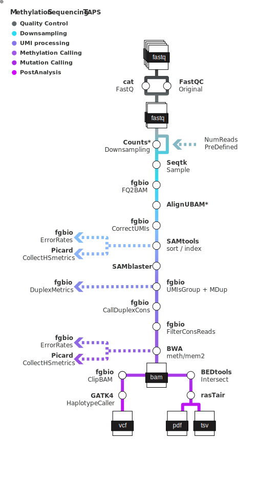

[](https://www.nextflow.io/)
[](https://github.com/nf-core/tools/releases/tag/3.3.1)
[](https://docs.conda.io/en/latest/)
[](https://www.docker.com/)
[](https://sylabs.io/docs/)

## Introduction

**CTI/MSTinn** Stands for CMO Technology Innovation Lab / Methylation Sequencing TAPS by Innovation

<picture>
  <source media="(prefers-color-scheme: dark)" srcset="assets/MSTinn_logo_dark.png">
  
</picture>

<picture>
  <source media="(prefers-color-scheme: dark)" srcset="assets/MSTinn_metro_dark.svg">
  
</picture>

1. Merge FastQ files ([`cat`](http://www.linfo.org/cat.html))
2. Read QC ([`FastQC`](https://www.bioinformatics.babraham.ac.uk/projects/fastqc/))
3. UMI processing ([`fgbio`](https://fulcrumgenomics.github.io/fgbio/))
4. Map Reads to Reference ([`BWA-meth`](https://github.com/brentp/bwa-meth), [`BWA-mem2`](https://github.com/bwa-mem2/bwa-mem2))
5. Intersect Metiloma and Targets BED files ([`BEDtools intersect`](https://github.com/arq5x/bedtools/blob/master/docs/content/tools/intersect.rst))
6. Assess methylation bias and calculate best trimming thresholds([`PyMbias`]())
7. Assess methylation by ([`asTair`](https://bitbucket.org/bsblabludwig/astair/src/master/))
8. Assess methylation by ([`rasTair`])
9. Present QC for raw reads ([`MultiQC`](http://multiqc.info/))

## Usage

> [!NOTE]
> If you are new to Nextflow and nf-core, please refer to [this page](https://nf-co.re/docs/usage/installation) on how to set-up Nextflow. Make sure to [test your setup](https://nf-co.re/docs/usage/introduction#how-to-run-a-pipeline) with `-profile test` before running the workflow on actual data.

<!-- TODO nf-core: Describe the minimum required steps to execute the pipeline, e.g. how to prepare samplesheets.
     Explain what rows and columns represent. For instance (please edit as appropriate):

First, prepare a samplesheet with your input data that looks as follows:

`samplesheet.csv`:

```csv
sample,fastq_1,fastq_2
CONTROL_REP1,AEG588A1_S1_L002_R1_001.fastq.gz,AEG588A1_S1_L002_R2_001.fastq.gz
```

Each row represents a fastq file (single-end) or a pair of fastq files (paired end).

-->

Now, you can run the pipeline using:

<!-- TODO nf-core: update the following command to include all required parameters for a minimal example -->

```bash
nextflow run cti/mstinn \
   -profile <docker/singularity/.../institute> \
   --input samplesheet.csv \
   --outdir ../03_outs
```

> [!WARNING]
> Please provide pipeline parameters via the CLI or Nextflow `-params-file` option. Custom config files including those provided by the `-c` Nextflow option can be used to provide any configuration _**except for parameters**_; see [docs](https://nf-co.re/docs/usage/getting_started/configuration#custom-configuration-files).

## Pipeline output

To see the results of an example test run with a full size dataset refer to the [results](https://jblancoheredia/mstinn/results) tab on the nf-core website pipeline page.
For more details about the output files and reports, please refer to the
[output documentation](https://jblancoheredia/mstinn/output).

## Credits

MSTinn was originally written by Juan Blanco-Heredia at the Marie-Josée and Henry R. Kravis Center for Molecular Oncology, Technology Innovation Lab, Memorial Sloan Kettering Cancer Center.

Main developer:

- [Juan Blanco-Heredia](blancoj@mskcc.org)

We thank the following people for their extensive assistance in the development of this pipeline:

- [Caryn Hale](halec@mskcc.org)
- [Grittney Tam](tamg@mskcc.org)
- [Brian Loomis](loomisb@mskcc.org)

## Contributions and Support

If you would like to contribute to this pipeline, please see the [contributing guidelines](.github/CONTRIBUTING.md).

## Citations

An extensive list of references for the tools used by the pipeline can be found in the [`CITATIONS.md`](CITATIONS.md) file.

This pipeline uses code and infrastructure developed and maintained by the [nf-core](https://nf-co.re) community, reused here under the [MIT license](https://github.com/nf-core/tools/blob/main/LICENSE).

> **The nf-core framework for community-curated bioinformatics pipelines.**
>
> Philip Ewels, Alexander Peltzer, Sven Fillinger, Harshil Patel, Johannes Alneberg, Andreas Wilm, Maxime Ulysse Garcia, Paolo Di Tommaso & Sven Nahnsen.
>
> _Nat Biotechnol._ 2020 Feb 13. doi: [10.1038/s41587-020-0439-x](https://dx.doi.org/10.1038/s41587-020-0439-x).
